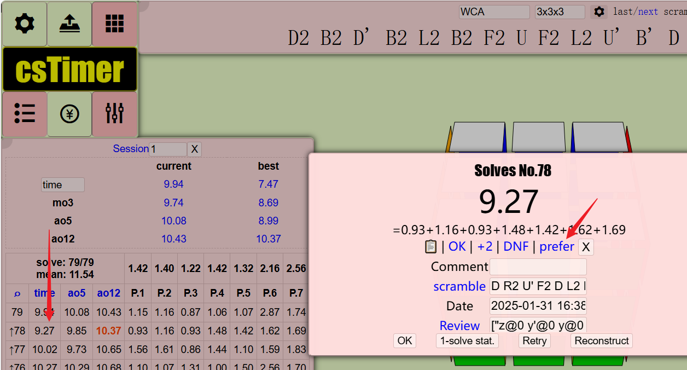
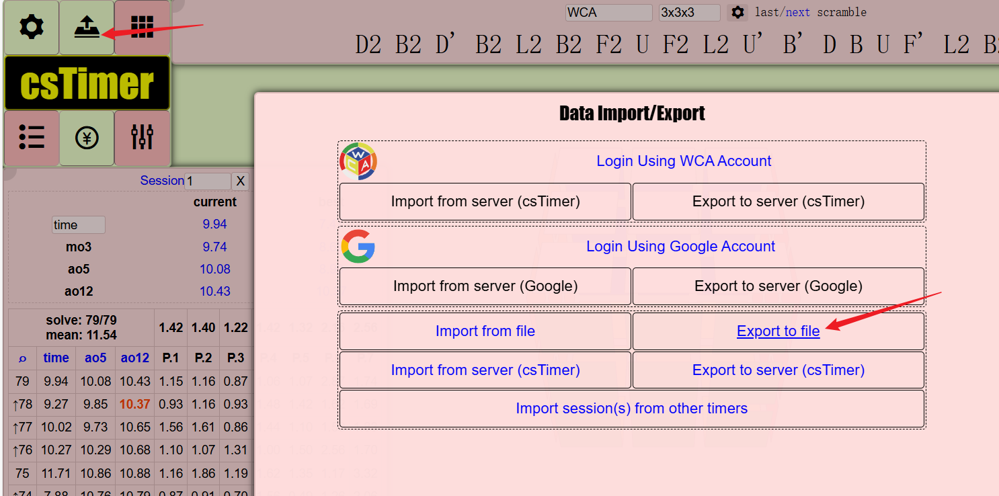

# Cube Status Critic

English | [中文](./README_CN.md)


Using IRL(Inverse Reinforcement Learning) to train a reward function for a Rubik's cube/other cube's status.

# Usage

## Collect human prefer data throw custom [cstimer](https://alex-beng.github.io/cstimer/)



When solved a scramble, click `prefer` to switch the preference against last scramble, or use shortcut `Ctrl + J` or `Ctrl + K` to set prefer or not.


There while be an up arrow besied the result to showing the preference to this scramble against the last one.


All the timing ways should be supported, if you got any problems in using custom cstimer, please issue [here](https://github.com/Alex-Beng/CubeStatusCritic/issues).

## Export data



Use cstimer's `Export to file` built-in function to export the data file, which will be used in the traing part.


## Write config in `config.py` and train

Make a `config.py` firstly like:
```bash
cp config.py.template config.py
```

Custom your config in the `config.py`


## Train, export and deployment ONNX model

```python
# main.py

workspace  = train.Workspace(cfg, args)
embed() 
# instead of rigid sequential calls
# workspace.train()
# workspace.infer()
# workspace.to_onnx()
```

By using `Ipython.embed()` to start an interactive terminal and techniques like reloading the `WorkSpace` class instance, we have greatly facilitated the interactive training and exporting of ONNX models. Additionally, it allows for modifying training hyperparameters at runtime, changing the implementation of workspace interfaces, etc.


Currently, in our custom [cstimer](https://alex-beng.github.io/cstimer/), we have implemented preference value inference for the magic clock state. Special thanks to ZZY and JYH from Northwestern Polytechnical University (NWPU) for providing the initial data.

