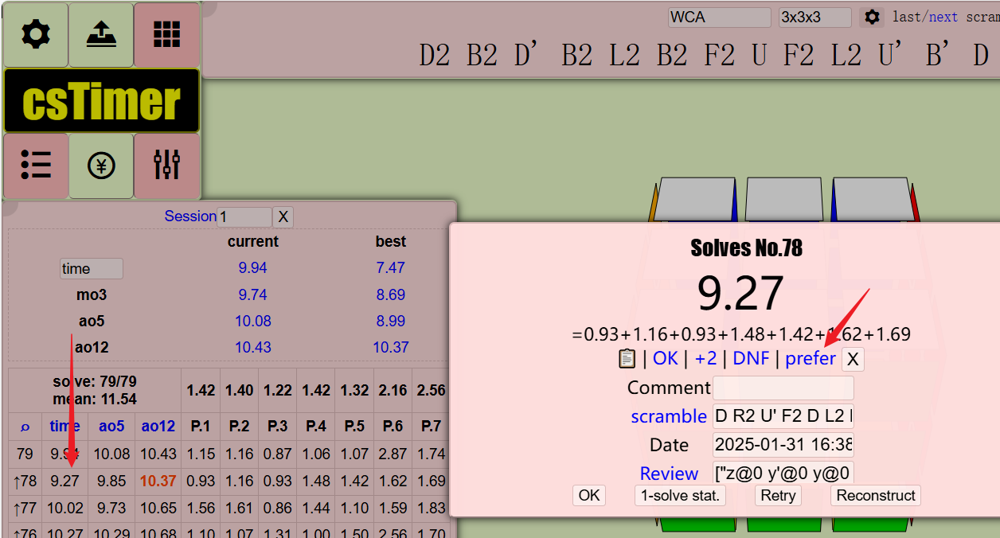
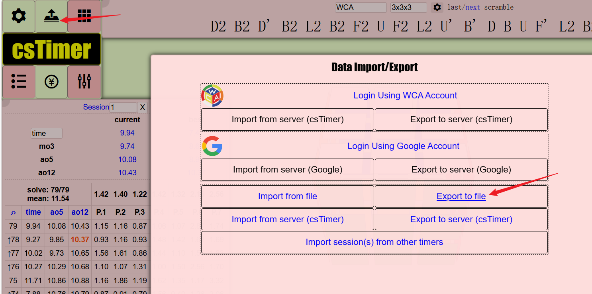

# Cube Status Critic

英文 | [中文](./README_CN.md)


使用 IRL（逆向强化学习）训练三阶魔方/其他魔方状态的奖励函数


# 使用方法

## 1. 收集人类偏好数据

通过自定义的 [cstimer](https://alex-beng.github.io/cstimer/) 收集人类偏好数据。



当你解决了一个打乱时，点击 `prefer` 选项以切换对比上一个打乱状态的偏好，或者使用快捷键 `Ctrl + J` 或 `Ctrl + K` 来设置偏好或不偏好。


在结果旁边会出现一个向上箭头，表示当前打乱状态相对于上一个打乱状态的偏好程度。


所有计时方式都应支持，如果你在使用自定义的 cstimer 时遇到任何问题，请在此 [issue](https://github.com/Alex-Beng/CubeStatusCritic/issues) 中 issue。

### 2. 导出数据



使用 cstimer 的内置功能 `Export to file` 导出数据文件，该文件将在训练部分中使用。

### 3. 编写配置文件并训练

首先创建一个 `config.py` 文件，例如：
```bash
cp config.py.template config.py
```

在 `config.py` 中自定义你的配置。

### 4. 训练、导出和部署 ONNX 模型

待完成
