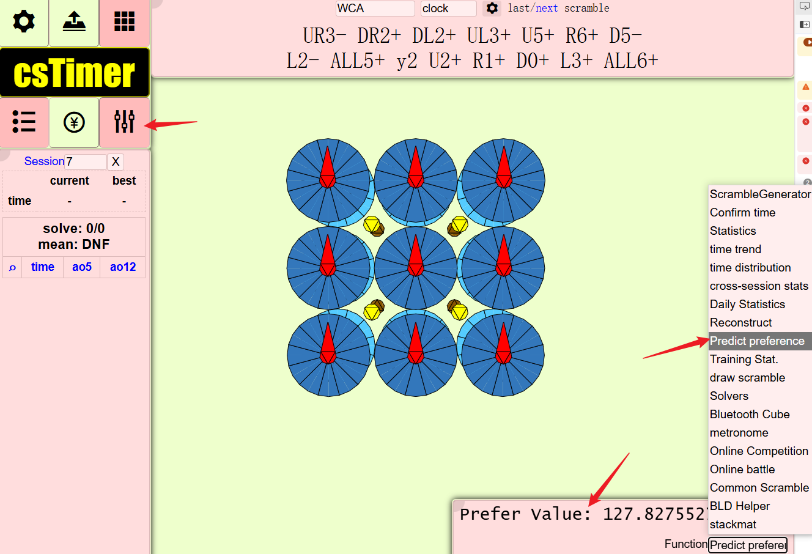

# Cube Status Critic

[English](./README.md) | 中文


使用 IRL（逆向强化学习）训练三阶魔方/其他魔方状态的奖励函数


# 使用方法

## 1. 收集人类偏好数据

通过自定义的 [cstimer](https://alex-beng.github.io/cstimer/) 收集人类偏好数据。


当你解决了一个打乱时，点击 `prefer` 选项以切换对比上一个打乱状态的偏好，或者使用快捷键 `Ctrl + J` 或 `Ctrl + K` 来设置偏好或不偏好。


在结果旁边会出现一个向上箭头，表示当前打乱状态相对于上一个打乱状态的偏好程度。


所有计时方式都应支持，如果你在使用自定义的 cstimer 时遇到任何问题，请在此 [issue](https://github.com/Alex-Beng/CubeStatusCritic/issues) 中 issue。

### 2. 导出数据


使用 cstimer 的内置功能 `Export to file` 导出数据文件，该文件将在训练部分中使用。

### 3. 编写配置文件并训练

首先创建一个 `config.py` 文件，例如：
```bash
cp config.py.template config.py
```

在 `config.py` 中自定义你的配置。

### 4. 训练、导出和部署 ONNX 模型

```python
# main.py

workspace  = train.Workspace(cfg, args)
embed() 
# 而不是死板的顺序调用
# workspace.train()
# workspace.infer()
# workspace.to_onnx()
```

我们通过 `Ipython.embd()` 开启的交互式终端、`WorkSpace` 类实例的reload等技术，极大地便利了交互式训练并导出 `ONNX` 模型的流程。除此之外，可以在运行时更改训练超参数、改变workspace接口的实现等。


目前，在自定义的 [cstimer](https://alex-beng.github.io/cstimer/) 中，已经实现了对魔表状态的偏好值推理。在此，特别感谢来自西北工业大学（NWPU）的 ZZY 和 JYH 同学提供了最初的数据。

